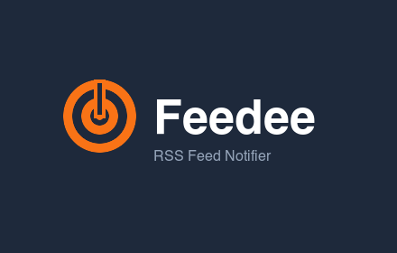

<p align="center">
  
</p>

<h1 align="center">Feedee</h1>

<p align="center">
  <strong>RSS & Atom Feed Notifier for Chrome</strong><br>
  A lightweight extension that lives in your side panel and keeps you up to date.
</p>

<p align="center">
  <a href="https://github.com/furybee/chrome-feedee/blob/main/LICENSE"></a>
  <a href="https://github.com/furybee/chrome-feedee/releases"></a>
  
  
  
</p>

---

## Features

| | Feature | Description |
|---|---|---|
| **📡** | **Side panel UI** | Browse all your articles without leaving the current tab |
| **🔔** | **Desktop notifications** | Get notified when new articles are published |
| **🔢** | **Badge counter** | Unread article count displayed on the extension icon |
| **🔍** | **Search** | Filter articles by title or feed name |
| **🏷️** | **Feed filter** | Show/hide articles per feed with multi-select checkboxes |
| **📅** | **Group by date** | Articles organized into Today, This week, This month, etc. |
| **⏱️** | **Auto-refresh** | Configurable interval (1–120 min) |
| **🎨** | **Custom tag colors** | Assign a color to each feed for visual identification |
| **🌙** | **Dark mode** | Follows system preference automatically |
| **🌐** | **i18n** | English and French |
| **📤** | **Export feeds** | Export your feed list for backup or sharing |

## Getting Started

### Prerequisites

- [Node.js](https://nodejs.org/) >= 18
- Google Chrome or any Chromium-based browser

### Install from source

```bash
git clone git@github.com:furybee/chrome-feedee.git
cd chrome-feedee
npm install
npm run build
```

1. Open `chrome://extensions/`
2. Enable **Developer mode** (top right)
3. Click **Load unpacked** and select the `dist/` folder

### Build for Chrome Web Store

```bash
npm run build:zip
```

Produces `feedee.zip` ready for upload.

## Usage

1. Click the **Feedee icon** in the toolbar to open the side panel
2. Open **Settings** (gear icon) to add your RSS/Atom feeds
3. Articles appear in the side panel, sorted by date
4. Use the **search bar** to filter by keyword
5. Use the **filter button** to show/hide specific feeds

## Permissions

| Permission | Reason |
|---|---|
| `alarms` | Schedule periodic feed checks |
| `notifications` | Desktop alerts for new articles |
| `storage` | Persist feeds, settings, and seen articles |
| `sidePanel` | Display the main UI in the browser side panel |
| `*://*/*` | Fetch RSS/Atom XML from any user-configured URL |

## Project Structure

```
feedee/
├── src/
│   └── background.js        # Service worker — fetch, parse, notify, badge
├── sidepanel.html            # Side panel markup
├── sidepanel.css             # Styles (light + dark theme)
├── sidepanel.js              # Side panel logic — render, search, filter
├── _locales/
│   ├── en/messages.json      # English translations
│   └── fr/messages.json      # French translations
├── icons/                    # Extension icons (16, 48, 128)
├── lib/                      # Vendored Coloris (color picker)
├── manifest.json             # Chrome extension manifest v3
├── vite.config.js            # Build configuration
└── dist/                     # Built extension (load this in Chrome)
```

## Tech Stack

- **Vanilla JS** — No framework, no bloat
- **Vite** — Fast build tooling
- **rss-parser** — RSS/Atom feed parsing
- **Coloris** — Lightweight color picker
- **Chrome Extensions API** — Manifest V3, Side Panel, Notifications, Alarms

## Contributing

1. Fork the repository
2. Create a feature branch (`git checkout -b feature/amazing-feature`)
3. Commit your changes
4. Push to the branch (`git push origin feature/amazing-feature`)
5. Open a Pull Request

## License

[MIT](LICENSE) — furybee
